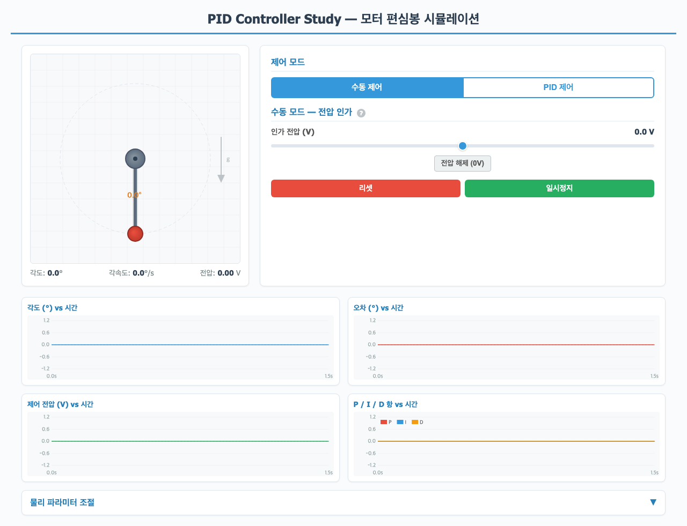
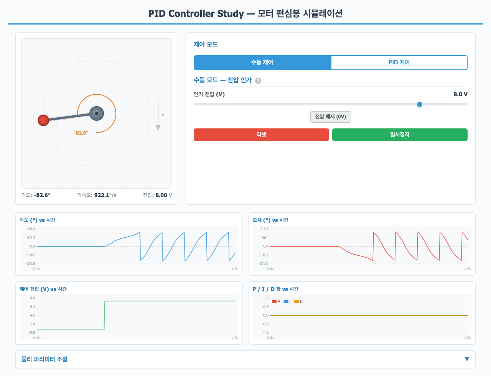
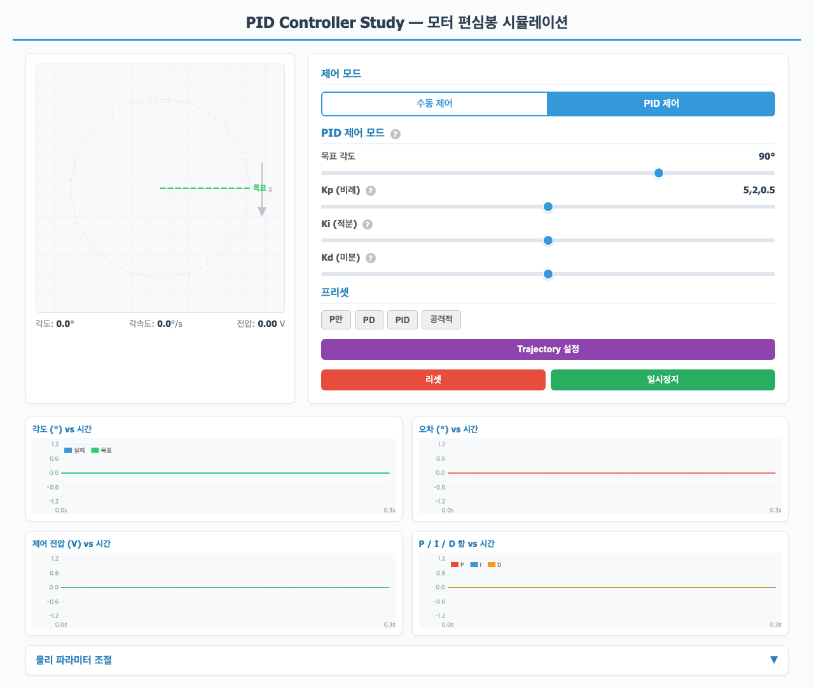
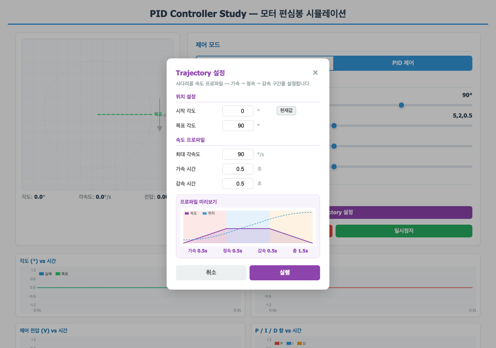
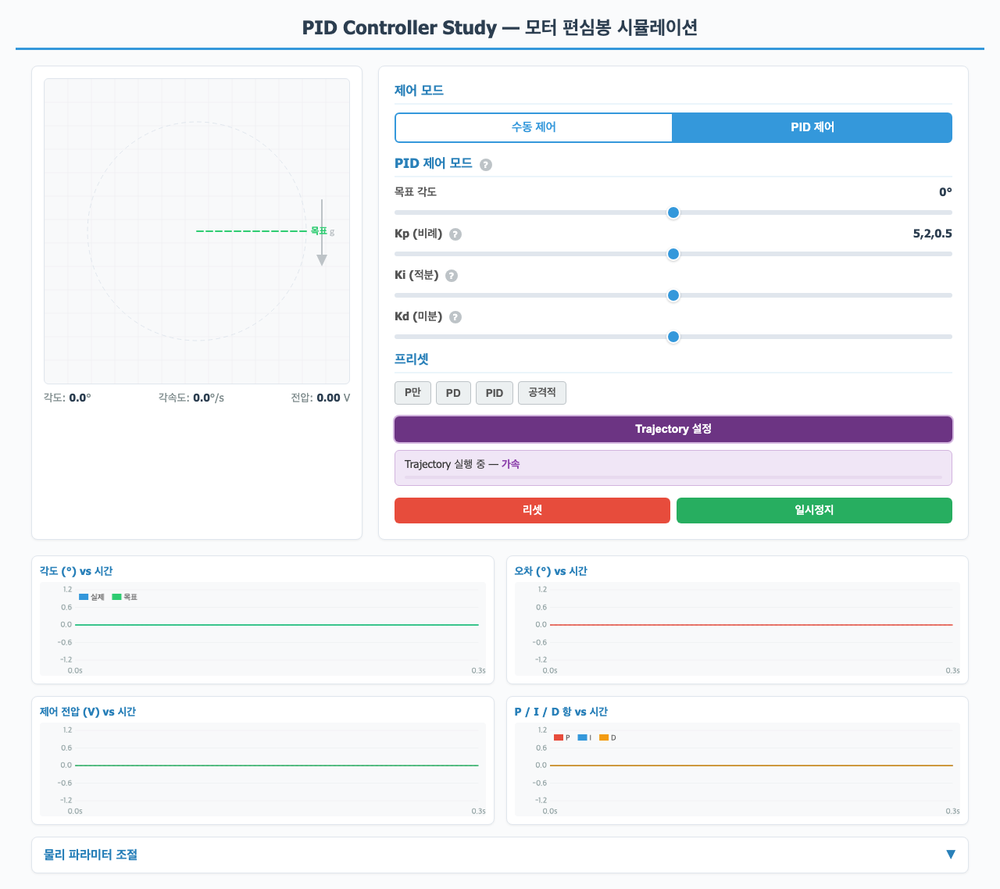
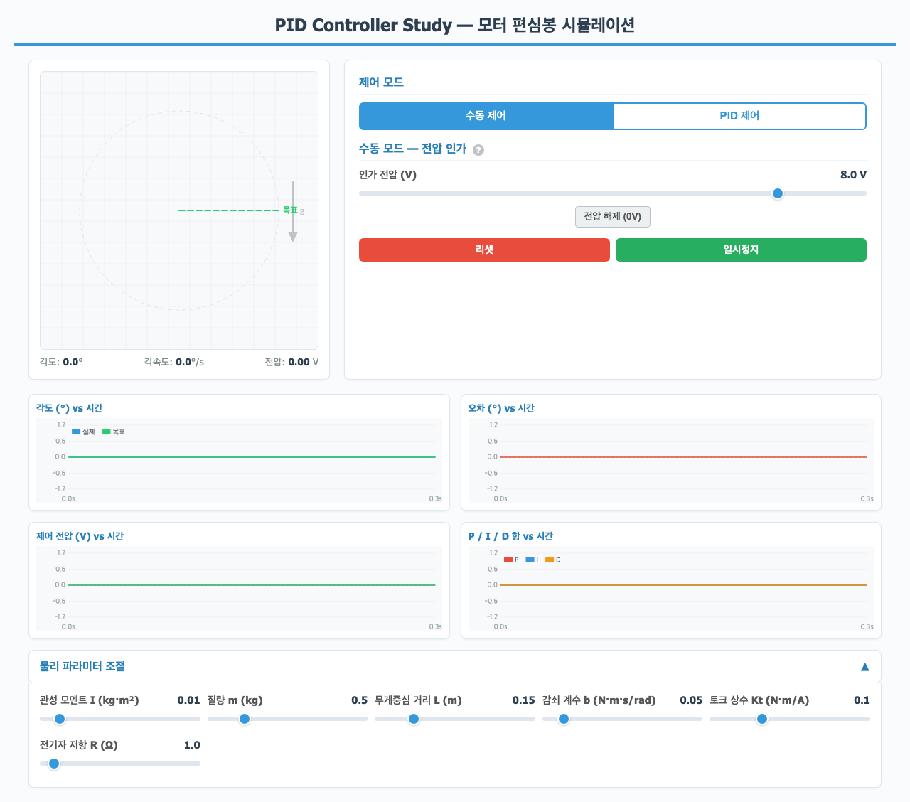

# PID Controller Study — 모터 편심봉 시뮬레이션

DC 모터에 편심봉(불균형 로드)이 달린 시스템을 대상으로 PID 제어기의 원리를 학습하는 브라우저 기반 인터랙티브 시뮬레이터입니다.

> **PinkLAB** 교육 자료 시리즈의 일부입니다.



## 주요 기능

### 수동 제어 모드
- 모터에 직접 전압을 인가하여 편심봉의 회전을 관찰
- 중력, 관성, 감쇠가 적용된 물리 시뮬레이션

### PID 제어 모드
- 목표 각도를 설정하고 P, I, D 게인을 조절하여 제어 성능 관찰
- **프리셋 제공**: P만, PD, PID, 공격적 PID — 각 조합의 특성 비교 학습

| 프리셋 | Kp | Ki | Kd | 특성 |
|--------|-----|-----|-----|------|
| P only | 5 | 0 | 0 | 지속 진동 |
| PD | 5 | 0 | 0.5 | 감쇠, 정상상태 오차 존재 |
| PID | 5 | 2 | 0.5 | 완전 수렴 |
| Aggressive | 20 | 10 | 1 | 오버슈트 / 불안정 |

### Trajectory 모드
- 여러 목표 각도를 순차적으로 추적하는 경로 추종 기능

### 실시간 그래프 (4개)
- 각도 vs 시간
- 오차 vs 시간
- 제어 전압 vs 시간
- P / I / D 항 vs 시간

### 물리 파라미터 조절
- 관성 모멘트, 질량, 감쇠 계수 등을 실시간으로 변경 가능

## 물리 모델

**구동 진자(Driven Pendulum)**: DC 모터 축에 질량이 한쪽 끝에 집중된 봉이 달린 시스템

**모터 토크**:
```
τ_motor = Kt × (V - Ke × ω) / R
```

**뉴턴 회전 법칙**:
```
I × α = τ_motor - m·g·L·sin(θ) - b·ω
```

| 파라미터 | 설명 | 기본값 |
|----------|------|--------|
| I | 관성 모멘트 | 0.01 kg·m² |
| m | 질량 | 0.5 kg |
| g | 중력 가속도 | 9.81 m/s² |
| L | 회전축~질량 중심 거리 | 0.15 m |
| b | 감쇠 계수 | 0.05 N·m·s/rad |
| Kt | 토크 상수 | 0.1 N·m/A |
| R | 전기자 저항 | 1.0 Ω |

수치 적분: 4차 Runge-Kutta (dt = 1/240s, 프레임당 4 서브스텝, 60fps)

## 설치 및 실행

### 요구 사항
- Python 3.9+
- [Miniconda](https://docs.conda.io/en/latest/miniconda.html) 또는 Anaconda (권장)

### 설치

```bash
# 저장소 클론
git clone https://github.com/PinkWink/PID-Basic.git
cd PID-Basic

# conda 환경 생성 및 활성화
conda create -n study python=3.11 flask -y
conda activate study

# 또는 pip 사용
pip install flask
```

### 실행

```bash
python app.py
```

브라우저에서 **http://localhost:5001** 접속

### 페이지 구성

| URL | 내용 |
|-----|------|
| `http://localhost:5001/` | PID 시뮬레이터 (메인) |
| `http://localhost:5001/concept` | PID 제어기 개념 해설 |

## 사용 방법

### 1. 수동 모드로 시스템 이해하기
1. 브라우저에서 시뮬레이터 접속
2. **수동 제어** 모드 선택 (기본값)
3. 전압 슬라이더를 조작하여 모터에 전압 인가
4. 편심봉이 중력과 모터 토크의 상호작용으로 어떻게 움직이는지 관찰

### 2. PID 제어 모드로 학습하기
1. **PID 제어** 모드로 전환
2. 목표 각도 설정 (0~360도)
3. 프리셋 버튼으로 P, PD, PID 조합을 전환하며 비교
4. 실시간 그래프에서 각 제어 항의 기여도 확인

### 3. Trajectory 모드
1. PID 모드에서 **Trajectory 모드** 버튼 클릭
2. 자동으로 여러 목표 각도를 순차 추적하는 과정 관찰

## 기술 스택

- **프론트엔드**: 순수 HTML + CSS + JavaScript (외부 라이브러리 없음)
- **렌더링**: Canvas API (애니메이션 + 실시간 그래프)
- **백엔드**: Python Flask (HTML 서빙 전용)
- **물리 시뮬레이션**: 브라우저 JavaScript에서 60fps 실시간 실행

## 프로젝트 구조

```
study_pid/
├── app.py              # Flask 서버 (HTML 서빙)
├── static/
│   └── index.html      # 시뮬레이터 (물리엔진 + PID + 애니메이션 + 그래프 올인원)
├── PID의_개념.html      # PID 제어기 개념 해설 페이지
└── README.md           # 이 파일
```

## 스크린샷

### 수동 제어 모드



### PID 제어 모드



### Trajectory 모드



### 물리 파라미터 조절


### 공격적 PID 튜닝


## 라이선스

교육 목적으로 자유롭게 사용할 수 있습니다.

---

이 프로젝트는 [Claude Code](https://claude.ai/code) (Anthropic)를 활용하여 제작되었습니다.

**PinkLAB** 교육 자료 시리즈
